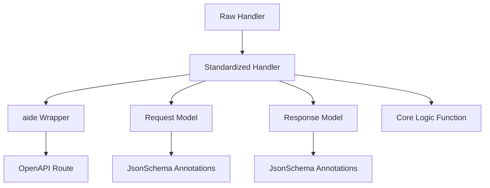
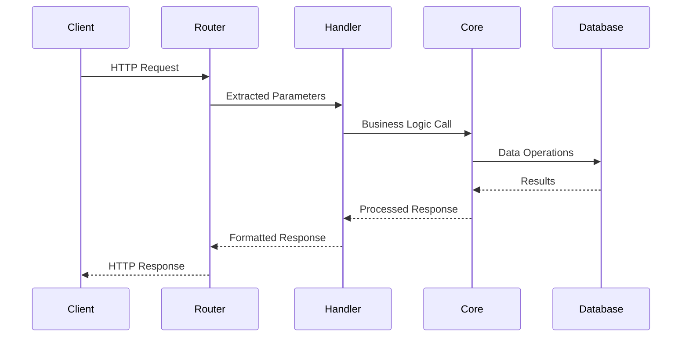
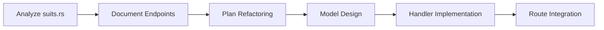

# MCPMate Backend API Handler Refactoring Design

## Overview

This document outlines the comprehensive refactoring of MCPMate backend API handlers to achieve standardized, OpenAPI-compliant documentation generation through aide integration. The refactoring focuses on normalizing handler signatures, implementing proper request/response models, and establishing consistent routing patterns.

### Project Context
- **Target**: MCPMate Backend API handlers in `./backend/src/api/routes/`
- **Scope**: Complete refactoring of `server.rs` and `suits.rs` routes
- **Dependencies**: Already refactored routes include `cache.rs`, `clients.rs`, `notifs.rs`, `system.rs`, and `runtime.rs`
- **Documentation**: Follows patterns defined in `handler-aide-integration-guide.md` and `server-endpoints-refactor.http`

### Core Objectives
1. **Standardize Handler Signatures**: Transform all handlers to follow `State + Request → Response` pattern
2. **Enable OpenAPI Documentation**: Integrate aide macros for automatic API documentation generation
3. **Eliminate Route Ambiguity**: Replace path parameters with query/payload parameters
4. **Improve Type Safety**: Use structured request/response types instead of generic types
5. **Maintain Backward Compatibility**: Ensure existing functionality remains intact

## Architecture

### Handler Standardization Pattern



### Request Flow Architecture



## Handler Refactoring Strategy

### Phase 1: Server Routes Refactoring

#### Current State Analysis
Based on `server-endpoints-refactor.http`, the server module contains 16 endpoints that need transformation:

| Category | Endpoints | Pattern | Status |
|----------|-----------|---------|---------|
| Management | list, details, create, update, delete | Query/Payload | Planned |
| Configuration | import, manage | Payload | Planned |
| Capabilities | tools, resources, prompts | Query | Planned |
| Instances | instances/*, health | Query/Payload | Planned |

#### Target Handler Signature Pattern

```rust
// Standardized GET handler with Query parameters
pub async fn operation_name(
    State(app_state): State<Arc<AppState>>,
    Query(request): Query<OperationReq>,
) -> Result<Json<ApiResponse<OperationResp>>, StatusCode> {
    let db_pool = get_db_pool!(app_state);
    let result = operation_name_core(&request, &db_pool).await?;
    Ok(Json(result))
}

// Standardized POST handler with JSON payload
pub async fn operation_name(
    State(app_state): State<Arc<AppState>>,
    Json(request): Json<OperationReq>,
) -> Result<Json<ApiResponse<OperationResp>>, StatusCode> {
    let db_pool = get_db_pool!(app_state);
    let result = operation_name_core(&request, &db_pool).await?;
    Ok(Json(result))
}
```

#### Model Definitions Pattern

```rust
// Request Model Example
#[derive(Debug, Serialize, Deserialize, JsonSchema)]
#[schemars(description = "Request for server list operation")]
pub struct ServerListReq {
    #[serde(default)]
    #[schemars(description = "Filter by enabled status")]
    pub enabled: Option<bool>,

    #[serde(default)]
    #[schemars(description = "Filter by server type: stdio|sse|streamable_http")]
    pub server_type: Option<String>,

    #[serde(default)]
    #[schemars(description = "Page limit for pagination")]
    pub limit: Option<u32>,

    #[serde(default)]
    #[schemars(description = "Page offset for pagination")]
    pub offset: Option<u32>,
}

// Response Model Example
#[derive(Debug, Serialize, Deserialize, JsonSchema)]
#[schemars(description = "Response for server list operation")]
pub struct ServerListResp {
    #[schemars(description = "List of server configurations")]
    pub servers: Vec<ServerInfo>,

    #[schemars(description = "Total count of servers")]
    pub total: usize,

    #[schemars(description = "ISO 8601 timestamp of last update")]
    pub last_updated: String,
}
```

### Phase 2: Suits Routes Analysis

#### Anticipated Challenges
The `suits.rs` module is expected to present similar complexity to the server module, requiring:

1. **Endpoint Inventory**: Complete mapping of existing endpoints
2. **Parameter Analysis**: Identification of path vs query parameter usage
3. **Response Type Standardization**: Elimination of generic response types
4. **Business Logic Extraction**: Separation of core logic from HTTP handling

#### Preparation Strategy


## aide Integration Specifications

### Wrapper Macro Usage

#### GET with Query Parameters
```rust
// In handlers module
pub async fn server_list(
    State(state): State<Arc<AppState>>,
    Query(query): Query<ServerListReq>,
) -> Result<Json<ApiResponse<ServerListResp>>, StatusCode> {
    // Handler implementation
}

// In routes module
aide_wrapper_query!(
    server_handlers::server_list,
    ServerListReq,
    ServerListResp,
    "List all MCP servers with optional filtering"
);

// Route registration
.api_route("/mcp/servers/list", get_with(server_list_aide, server_list_docs))
```

#### POST with JSON Payload
```rust
// For complex POST operations that current aide macros cannot handle
// Use traditional routing with manual documentation
.route("/mcp/servers/complex", post(server_handlers::complex_operation))
```

### Documentation Standards

#### JsonSchema Annotations
```rust
#[derive(Debug, Serialize, Deserialize, JsonSchema)]
#[schemars(description = "Server management request")]
pub struct ServerManageReq {
    #[schemars(description = "Unique server identifier")]
    pub id: String,

    #[derive(JsonSchema)]
    #[schemars(description = "Management action: enable|disable")]
    pub action: ManageAction,

    #[serde(default)]
    #[schemars(description = "Whether to sync client configuration")]
    pub sync: bool,
}

#[derive(Debug, Serialize, Deserialize, JsonSchema)]
#[schemars(description = "Management action enum")]
pub enum ManageAction {
    #[schemars(description = "Enable the server")]
    Enable,
    #[schemars(description = "Disable the server")]
    Disable,
}
```

#### Comment Guidelines
- **Remove all `///` comments**: Only use `#[schemars(description)]`
- **Self-documenting functions**: Function names should be clear and descriptive
- **Preserve inline comments**: Keep `//` comments for complex business logic explanation

## Implementation Plan

### Milestone 1: Server Routes Foundation
1. **Model Definition** (2-3 hours)
   - Create `src/api/models/server.rs`
   - Define all request/response structures
   - Add JsonSchema annotations

2. **Handler Refactoring** (4-6 hours)
   - Transform existing handlers to standard signature
   - Extract core business logic functions
   - Remove documentation comments

3. **Route Integration** (2-3 hours)
   - Apply aide wrapper macros
   - Update route registrations
   - Test OpenAPI generation

### Milestone 2: Server Routes Validation
1. **Compilation Verification**
   ```bash
   cargo check
   ```

2. **Code Quality Verification**
   ```bash
   cargo clippy
   ```

3. **Functional Testing**
   - Manual testing will be performed by the team
   - All endpoints should respond correctly
   - Parameter validation should work as expected
   - Error handling should be consistent

### Milestone 3: Suits Routes Preparation
1. **Endpoint Analysis**
   - Map all existing endpoints in `suits.rs`
   - Document current parameter patterns
   - Identify complex cases

2. **Refactoring Strategy**
   - Design model structures
   - Plan handler transformations
   - Prepare aide integration approach

## Risk Management

### Technical Risks

| Risk | Impact | Mitigation |
|------|--------|------------|
| aide macro limitations | High | Use traditional routing for complex cases |
| Breaking changes | High | Maintain parallel testing environment |
| Performance regression | Medium | Benchmark before/after implementation |
| Documentation gaps | Low | Systematic review process |

### Contingency Plans

#### aide Macro Incompatibility
If complex POST operations cannot be handled by current aide macros:
1. **Stop and discuss**: Escalate to team for macro enhancement
2. **Temporary solution**: Use traditional routing with manual OpenAPI annotations
3. **Document limitations**: Track cases requiring future enhancement

#### Handler Complexity
For handlers that cannot be easily standardized:
1. **Gradual refactoring**: Split complex handlers into smaller components
2. **Preserve functionality**: Ensure no behavioral changes during refactoring
3. **Extended timeline**: Allow additional time for complex cases

## Validation Framework

### Code Quality Checks
```bash
# Compilation validation
cargo check

# Code quality validation
cargo clippy
```

### Functional Verification
1. **Parameter Validation**: All request models properly deserialize
2. **Response Structure**: All responses match defined schemas
3. **Error Handling**: Proper error codes and messages
4. **Documentation**: Complete OpenAPI specification generation

### Documentation Quality
1. **Schema Completeness**: All fields have meaningful descriptions
2. **Example Generation**: OpenAPI examples are accurate
3. **Type Safety**: No generic or ambiguous response types
4. **Consistency**: Uniform naming and structure patterns

## Success Metrics

### Quantitative Measures
- **Handler Standardization**: 100% of handlers follow standard signature pattern
- **Model Coverage**: All endpoints have dedicated request/response models
- **Documentation Generation**: Complete OpenAPI specification with descriptions
- **aide Integration**: Maximum use of aide wrapper macros where applicable

### Qualitative Measures
- **Code Maintainability**: Cleaner, more readable handler implementations
- **API Consistency**: Uniform parameter and response patterns
- **Developer Experience**: Improved API discoverability through documentation
- **Type Safety**: Elimination of generic response types

## Future Considerations

### Post-Refactoring Optimizations
1. **Performance Tuning**: Optimize handler execution paths
2. **Caching Strategies**: Implement response caching where appropriate
3. **Monitoring Integration**: Add metrics and observability
4. **Security Enhancements**: Implement rate limiting and validation

### Scalability Preparations
1. **Async Optimization**: Ensure all handlers are properly async
2. **Database Connection Pooling**: Optimize database access patterns
3. **Error Recovery**: Implement robust error handling and recovery
4. **Load Testing**: Validate performance under load

This refactoring establishes a solid foundation for maintainable, well-documented APIs that follow modern Rust web development practices while ensuring seamless integration with OpenAPI documentation generation tools.