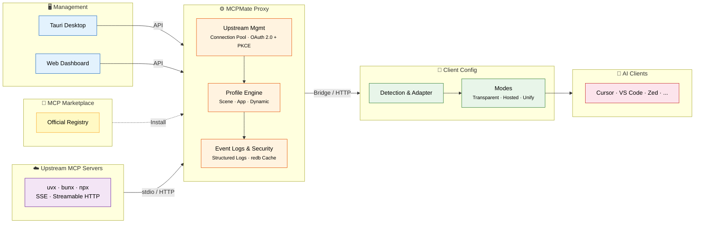

# MCPMate

**English** | [中文](./README_CN.md)

<p align="center">
  
</p>

<p align="center">
  <strong>One local proxy that connects MCP servers and AI clients.</strong>
</p>

<p align="center">
  <a href="https://github.com/loocor/MCPMate/blob/main/LICENSE"></a>
  
  
  
  <a href="https://modelcontextprotocol.io/specification/2025-06-18"></a>
</p>

---

> Configuring the same MCP servers across multiple clients is repetitive, token-costly, and hard to observe.
> MCPMate proxies MCP servers, syncs client configs, trims capabilities by profile, and logs activity.

This is not a brand-new project. I started shaping MCPMate around May 2024, paused active development around October, and recently came back to it with a clearer conviction: as the hype around skills- and CLI-shaped workflows settles into a more reflective phase, the long-term, irreplaceable value of MCP becomes easier to see.

MCPMate was previously developed in private and is now being reopened in public. The direction I care about most at this stage is usability: building on MCPMate's earlier profile-based approach for removing redundant capabilities in specific scenarios, and continuing to extend its hosted mode toward a more progressively disclosed Unify mode (last year I referred to it as a more "aggressive hosted" mode, though the name itself felt somewhat awkward). One goal is to bring some of the lower-friction and lower first-token-cost qualities that people appreciated in skills- and CLI-shaped experiences into MCP itself.

## 📑 Table of Contents

- [MCPMate](#mcpmate)
  - [📑 Table of Contents](#-table-of-contents)
  - [🤔 Why MCPMate?](#-why-mcpmate)
  - [🔄 How It Works](#-how-it-works)
  - [🚀 Key Features](#-key-features)
  - [🛠️ Core Components](#-core-components)
    - [Proxy](#proxy)
    - [Bridge](#bridge)
    - [Runtime Manager](#runtime-manager)
    - [Desktop App](#desktop-app)
    - [Logs](#logs)
  - [⚡ Quick Start](#-quick-start)
    - [Option A: Download the Desktop App (Recommended)](#option-a-download-the-desktop-app-recommended)
    - [Option B: Build from Source](#option-b-build-from-source)
    - [Option C: Online Demo](#option-c-online-demo)
  - [🧰 Tech Stack](#-tech-stack)
  - [🚢 Deployment Modes](#-deployment-modes)
  - [🔧 Development](#-development)
  - [🗺️ Roadmap](#-roadmap)
  - [🤝 Contributing](#-contributing)
  - [📄 License](#-license)

## 🤔 Why MCPMate?

Managing MCP servers across multiple AI tools (Claude Desktop, Cursor, Zed, Codex, and user-defined clients) brings significant challenges:

| · | Pain Point                                                            | · | MCPMate Solution                               |
| --- | --------------------------------------------------------------------- | --- | ---------------------------------------------- |
| ❌   | The same MCP server needs to be configured repeatedly in each client  | ✅   | One proxy, one unified configuration           |
| ❌   | Different work scenarios require frequent MCP configuration changes   | ✅   | Profile-based instant switching                |
| ❌   | Running multiple MCP servers simultaneously consumes system resources | ✅   | Single proxy aggregates all upstream servers   |
| ❌   | Configuration errors or security risks are hard to detect             | ✅   | Real-time monitoring, structured event logging |
| ❌   | No single place to manage all MCP services                            | ✅   | Dashboard + REST API + structured logs         |

## 🔄 How It Works



MCPMate sits between your AI clients and MCP servers as a transparent proxy. The **Bridge** adapts stdio-only clients (like Claude Desktop) to the HTTP proxy. The **Profile Engine** controls which tools are visible to which client — scene profiles for workflow context, app profiles for per-client tuning, and dynamic profiles that adjust at runtime. The client configuration layer covers Transparent, Hosted, and Unify management modes.

## 🚀 Key Features

| Feature                       | Description                                                                                                                             |
| ----------------------------- | --------------------------------------------------------------------------------------------------------------------------------------- |
| **Profile-Based Trimming**    | Organize MCP servers into scene, app, and dynamic profiles. Switch instantly without restarting services.                               |
| **Multi-Client Support**      | Detect, configure, and manage Claude Desktop, Cursor, Zed, Codex, and user-defined clients.                                             |
| **Dynamic Client Governance** | Database-first governance with Allow/Deny policies. No static template files. Verified config targets required for writes.              |
| **Market Integration**        | Browse and install from the official MCP registry without leaving the app. OAuth-capable servers supported with callback authorization. |
| **Runtime Manager**           | Installs and manages Node.js, uv (Python), and Bun runtimes used by local MCP servers.                                                  |
| **OAuth 2.0 Upstream (PKCE)** | Supports upstream OAuth 2.0 flows with PKCE for Streamable HTTP MCP servers, including metadata discovery and callback handling.        |
| **Built-in redb Cache**       | L2 embedded cache for capability snapshots and frequently accessed proxy state.                                                         |
| **Structured Logs**           | Dedicated Logs page with cursor-based pagination, actor/target/action metadata, and REST API access.                                    |
| **Browser Extension**         | Chrome/Edge extension detects `mcpServers` snippets on web pages and imports them via `mcpmate://import/server`.                        |
| **Tool Inspector**            | Run quick tool calls against connected servers and inspect structured responses from the console.                                       |

## 🛠️ Core Components

### Proxy

A high-performance MCP proxy server that connects to multiple MCP servers and aggregates their tools. Implements stdio and Streamable HTTP transport protocols (aligned with MCP 2025-06-18 specification). Accepts legacy SSE-configured servers and automatically normalizes them to Streamable HTTP for backward compatibility.

### Bridge

A lightweight bridging component that converts stdio protocol to HTTP transport without modifying the client. Automatically inherits all functions and tools from the HTTP service. Minimal configuration — only requires service address.

### Runtime Manager

Installs and manages runtimes used by local MCP servers. Supports Node.js, uv (Python), and Bun with download progress tracking and automatic environment variable configuration.

```bash
runtime install node   # Install Node.js for JavaScript MCP servers
runtime install uv     # Install uv for Python MCP servers
runtime install bun    # Install Bun
runtime list           # List installed runtimes
```

### Desktop App

Cross-platform desktop application built with Tauri 2. Complete graphical interface for managing MCP servers, profiles, and tools with real-time monitoring, intelligent client detection, and system tray integration. macOS is available now; Windows is in beta; Linux is in development.

### Logs

Structured operational log for MCP proxy activity. Collects MCP operations and management-side changes into a structured timeline with cursor-based pagination, REST APIs, and a dedicated Logs page in the dashboard UI.

## ⚡ Quick Start

### Option A: Download the Desktop App (Recommended)

Download the latest release for your platform from [GitHub Releases](https://github.com/loocor/MCPMate/releases).

> **Note**: macOS builds are currently unsigned and not notarized. You may need to right-click and select "Open" to bypass Gatekeeper on first launch. Code signing and notarization are planned for a future release.

### Option B: Build from Source

**Prerequisites**: [Rust](https://www.rust-lang.org/tools/install) 1.75+, [Node.js](https://nodejs.org/) 18+ or [Bun](https://bun.sh/), SQLite 3

**1. Clone & Build the Backend**

```bash
git clone https://github.com/loocor/MCPMate.git
cd MCPMate/backend
cargo build --release
```

**2. Start the Proxy**

```bash
cargo run --release
```

The proxy starts with:
- **REST API** on `http://localhost:8080`
- **MCP endpoint** on `http://localhost:8000`

**3. Launch the Dashboard**

```bash
cd ../board
bun install
bun run dev
```

Dashboard available at `http://localhost:5173`.

### Option C: Online Demo

Coming soon. An online environment will let you explore the dashboard, profiles, and client configuration without a local setup.

## 🧰 Tech Stack

| Layer               | Technology                                                          |
| ------------------- | ------------------------------------------------------------------- |
| **Proxy / Backend** | Rust, tokio, rmcp, SQLite (persistence), redb (L2 capability cache) |
| **Dashboard**       | React, Vite, Zustand, React Query, Radix UI                         |
| **Desktop**         | Tauri 2, system tray, native notifications                          |
| **Bridge**          | Rust binary, stdio-to-HTTP conversion                               |
| **Runtime Manager** | Multi-runtime (Node.js, uv, Bun)                                    |
| **Protocol**        | MCP 2025-06-18, stdio + Streamable HTTP                             |

## 🚢 Deployment Modes

- **Integrated mode (desktop)** — Tauri bundles backend + dashboard for local all-in-one operation
- **Separated mode (core server + UI)** — Run backend independently and connect either the web dashboard or desktop shell to that core service
- **Client mode flexibility** — Managed clients can continue using hosted/transparent workflows while the control plane runs remotely

## 🔧 Development

```bash
# Run all checks
./scripts/check

# Start backend + board together
./scripts/dev-all
```

See [AGENTS.md](./AGENTS.md) for development guidelines, coding standards, and contribution workflow.

## 🗺️ Roadmap

1. **Account-based configuration backup & restore**
2. **Skills-mode packaged profiles**
3. **Downstream MCP client OAuth authorization management**
4. **Cross-platform release readiness** — desktop OS stability, container-based deployment, and Homebrew installation support

## 🤝 Contributing

Contributions are welcome! Please:

1. Read [AGENTS.md](./AGENTS.md) for development guidelines
2. Open an issue to discuss significant changes
3. Submit pull requests against the `main` branch

## 📄 License

[GNU Affero General Public License v3.0](./LICENSE) (AGPL-3.0)

---

<p align="center">
  Built with ❤️ by <a href="https://github.com/loocor">Loocor</a>
</p>
