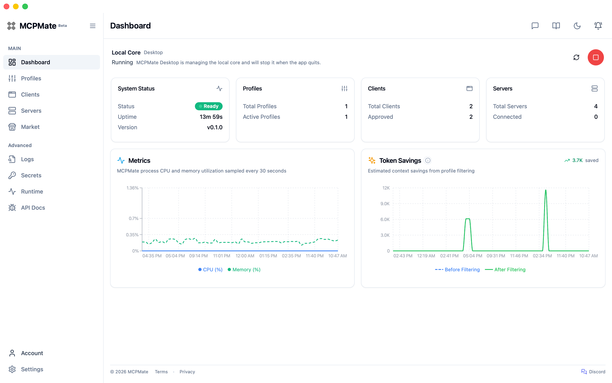
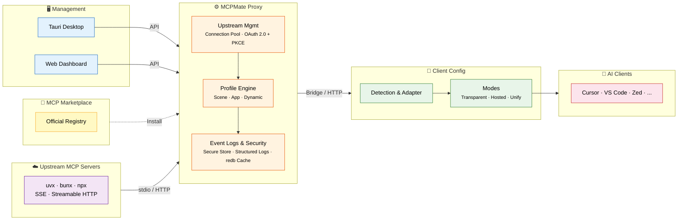

# MCPMate

<p align="right">
  <strong>English</strong> | <a href="./README_CN.md">中文</a> | <a href="./README_JP.md">日本語</a>
</p>

<p align="center">
  
</p>

<p align="center">
  <strong>Your progressive MCP management partner.</strong>
</p>

<p align="center">
  <a href="https://github.com/loocor/MCPMate/releases"></a>
  <a href="https://github.com/loocor/MCPMate/releases"></a>
  <a href="https://github.com/loocor/MCPMate/blob/main/LICENSE"></a>
  
  
  <a href="https://modelcontextprotocol.io/specification/2025-11-25"></a>
</p>

---

> **Import MCP once. Start simple, then add profiles, per-client tools, and setup modes as your workflow grows.**
>
> MCPMate is a local-first assistant that grows with you—not just another config file editor.

MCPMate sits between your AI apps and MCP servers so you manage connections once and send the right tools to each app. It works with Claude Desktop, Cursor, Codex, Zed, VS Code, CLI tools, and other clients that follow the standard MCP config format.

**Easy to begin, built to scale:** one import with low friction; the same setup still fits as MCP spreads across more clients, servers, and scenarios—no product swap, no restart ritual.

| Stage | What you get |
| ----- | ------------ |
| **Start** | Import servers, verify calls, and see health in one place |
| **Grow** | Scene profiles for coding, writing, or research; switch the full tool set in one click |
| **Tune** | Per-client trimming from one shared server library—less clutter, lower token use |
| **Choose how to connect** | **Transparent** (native config output), **Hosted** (durable proxy control), or **Unify** (small tool surface, on-demand discovery) |

Live site: [mcp.umate.ai](https://mcp.umate.ai) · Docs: [mcp.umate.ai/docs](https://mcp.umate.ai/docs/en/quickstart)

## 📑 Table of Contents

- [MCPMate](#mcpmate)
  - [📑 Table of Contents](#-table-of-contents)
  - [🤔 Why MCPMate?](#-why-mcpmate)
  - [🔄 How It Works](#-how-it-works)
  - [🚀 Key Features](#-key-features)
  - [🛠️ Core Components](#-core-components)
    - [Proxy](#proxy)
    - [Bridge](#bridge)
    - [Runtime Manager](#runtime-manager)
    - [Desktop App](#desktop-app)
    - [Logs](#logs)
  - [⚡ Quick Start](#-quick-start)
    - [Option A: Download the Desktop App (Recommended)](#option-a-download-the-desktop-app-recommended)
    - [Option B: Build from Source](#option-b-build-from-source)
    - [Option C: Online Demo](#option-c-online-demo)
  - [🧰 Tech Stack](#-tech-stack)
  - [🚢 Deployment Modes](#-deployment-modes)
  - [🔧 Development](#-development)
  - [🗺️ Roadmap](#-roadmap)
  - [🤝 Contributing](#-contributing)
  - [📄 License](#-license)

## 🤔 Why MCPMate?

Managing MCP across multiple AI tools (Claude Desktop, Cursor, Zed, Codex, and custom clients) gets messy fast:

| · | Pain Point | · | MCPMate approach |
| --- | ---------- | --- | ---------------- |
| ❌ | The same MCP setup is copied into every client by hand | ✅ | **Configure once, use everywhere** — servers, env vars, and connections live in one place |
| ❌ | Switching between coding, writing, and research means re-wiring each app | ✅ | **Switch scenarios instantly** — scene profiles swap the full tool set in one click |
| ❌ | Every client sees every tool, wasting tokens and cluttering the UI | ✅ | **Each client sees what it should** — one library, different visibility per app |
| ❌ | One integration style does not fit every client | ✅ | **Hosted**, **Unify**, or **Transparent** setup modes for the control level you need |
| ❌ | Hard to tell whether services are ready or calls are succeeding | ✅ | **See it, verify it** — inspector, structured logs, and dashboard in one local control plane |
| ❌ | Many MCP processes compete for RAM and handles | ✅ | A single proxy aggregates upstream servers with connection pooling |

## 🔄 How It Works



MCPMate sits between your AI clients and MCP servers. To each app it looks like a normal MCP endpoint—no workflow disruption—while profiles, policy, and routing stay in the middle layer. The **Bridge** adapts stdio-only clients (such as Claude Desktop) to the HTTP proxy. The **Profile Engine** decides which tools each client sees—scene profiles for workflow context, app profiles for per-client tuning, and dynamic profiles that adjust at runtime. **Transparent**, **Hosted**, and **Unify** setup modes let you choose how much MCPMate sits in the path versus writing native client configs.

## 🚀 Key Features

| Feature                       | Description                                                                                                                             |
| ----------------------------- | --------------------------------------------------------------------------------------------------------------------------------------- |
| **Profile-Based Trimming**    | Organize MCP servers into scene, app, and dynamic profiles. Switch instantly without restarting services.                               |
| **Multi-Client Support**      | Detect, configure, and manage Claude Desktop, Cursor, Zed, Codex, and user-defined clients.                                             |
| **Dynamic Client Governance** | Database-first governance with Allow/Deny policies. No static template files. Verified config targets required for writes.              |
| **Market Integration**        | Browse and install from the official MCP registry without leaving the app. Detail views can show GitHub README context, source metadata, and OAuth authorization. |
| **Runtime Manager**           | Installs and manages Node.js, uv (Python), and Bun runtimes used by local MCP servers.                                                  |
| **Secure Store & OAuth Custody** | Keeps local secrets, OAuth tokens, and client secrets in encrypted custody with lifecycle cleanup and degraded-state guidance.        |
| **OAuth 2.0 Upstream (PKCE)** | Supports upstream OAuth 2.0 flows with PKCE for Streamable HTTP MCP servers, including metadata discovery, callback handling, and reconnect flows. |
| **Built-in redb Cache**       | L2 embedded cache for capability snapshots and frequently accessed proxy state.                                                         |
| **Structured Logs**           | Dedicated Logs page with cursor-based pagination, actor/target/action metadata, and REST API access.                                    |
| **Browser Extension**         | Chrome/Edge extension browses Servers, Clients, and Portals, then imports MCP snippets, GitHub MCP entries, and Cursor.directory entries via `mcpmate://import/server`. |
| **Tool Inspector**            | Run quick tool calls against connected servers and inspect structured responses from the console.                                       |

## 🛠️ Core Components

### Proxy

A high-performance MCP proxy server that connects to multiple MCP servers and aggregates their tools. Implements stdio and Streamable HTTP transport protocols aligned with the current MCP specification. Accepts legacy SSE-configured servers and automatically normalizes them to Streamable HTTP for backward compatibility.

### Bridge

A lightweight bridging component that converts stdio protocol to HTTP transport without modifying the client. Automatically inherits all functions and tools from the HTTP service. Minimal configuration — only requires service address.

### Runtime Manager

Installs and manages runtimes used by local MCP servers. Supports Node.js, uv (Python), and Bun with download progress tracking and automatic environment variable configuration.

```bash
runtime install node   # Install Node.js for JavaScript MCP servers
runtime install uv     # Install uv for Python MCP servers
runtime install bun    # Install Bun
runtime list           # List installed runtimes
```

### Desktop App

Cross-platform desktop application built with Tauri 2. Complete graphical interface for managing MCP servers, profiles, and tools with real-time monitoring, intelligent client detection, and system tray integration. macOS, Windows, and Linux desktop builds are currently available as Beta releases.

### Logs

Structured operational log for MCP proxy activity. Collects MCP operations and management-side changes into a structured timeline with cursor-based pagination, REST APIs, and a dedicated Logs page in the dashboard UI.

## ⚡ Quick Start

### Option A: Download the Desktop App (Recommended)

Download the latest release for your platform from [GitHub Releases](https://github.com/loocor/MCPMate/releases).

> **Note**: macOS builds are signed and notarized to reduce system security prompts and improve package trust.

### Option B: Build from Source

**Prerequisites**: [Rust](https://www.rust-lang.org/tools/install) 1.85+, [Node.js](https://nodejs.org/) 18+ or [Bun](https://bun.sh/), SQLite 3

**1. Clone & Build the Backend**

```bash
git clone https://github.com/loocor/MCPMate.git
cd MCPMate/backend
cargo build --release
```

**2. Start the Proxy**

```bash
cargo run --release
```

The proxy starts with:
- **REST API** on `http://localhost:8080`
- **MCP endpoint** on `http://localhost:8000`

**3. Launch the Dashboard**

```bash
cd ../board
bun install
bun run dev
```

Dashboard available at `http://localhost:5173`.

### Option C: Online Demo

Coming soon. An online environment will let you explore the dashboard, profiles, and client configuration without a local setup.

## 🧰 Tech Stack

| Layer               | Technology                                                          |
| ------------------- | ------------------------------------------------------------------- |
| **Proxy / Backend** | Rust, tokio, rmcp, SQLite (persistence), redb (L2 capability cache) |
| **Dashboard**       | React, Vite, Zustand, React Query, Radix UI                         |
| **Desktop**         | Tauri 2, system tray, native notifications                          |
| **Bridge**          | Rust binary, stdio-to-HTTP conversion                               |
| **Runtime Manager** | Multi-runtime (Node.js, uv, Bun)                                    |
| **Protocol**        | MCP 2025-11-25, stdio + Streamable HTTP                             |

## 🚢 Deployment Modes

- **Integrated mode (desktop)** — Tauri bundles backend + dashboard for local all-in-one operation
- **Separated mode (core server + UI)** — Run backend independently and connect either the web dashboard or desktop shell to that core service
- **Client mode flexibility** — Managed clients can continue using hosted/transparent workflows while the control plane runs remotely

## 🔧 Development

```bash
# Run all checks
./scripts/check

# Start backend + board together
./scripts/dev-all
```

See [AGENTS.md](./AGENTS.md) for development guidelines, coding standards, and contribution workflow.

## 🗺️ Roadmap

1. **Discovery-to-install polish** — tighter browser extension, Market, README, and source-metadata flows
2. **Account-based configuration backup & restore**
3. **Skills-mode packaged profiles**
4. **Cross-platform release readiness** — desktop OS stability, container-based deployment, and Homebrew installation support

## 🤝 Contributing

Contributions are welcome! Please:

1. Read [AGENTS.md](./AGENTS.md) for development guidelines
2. Open an issue to discuss significant changes
3. Submit pull requests against the `main` branch

## 📄 License

[GNU Affero General Public License v3.0](./LICENSE) (AGPL-3.0)
