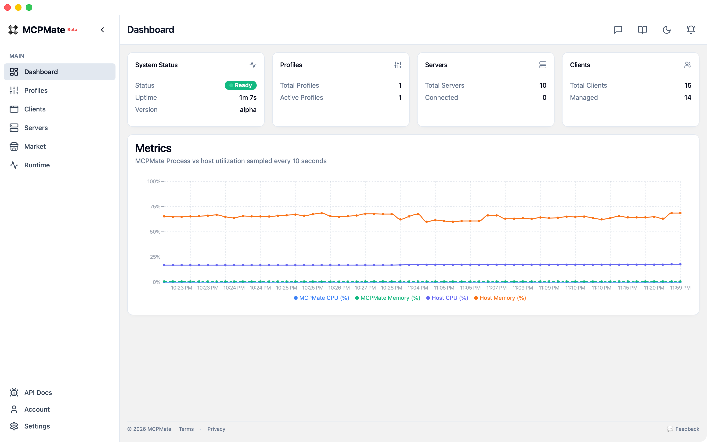
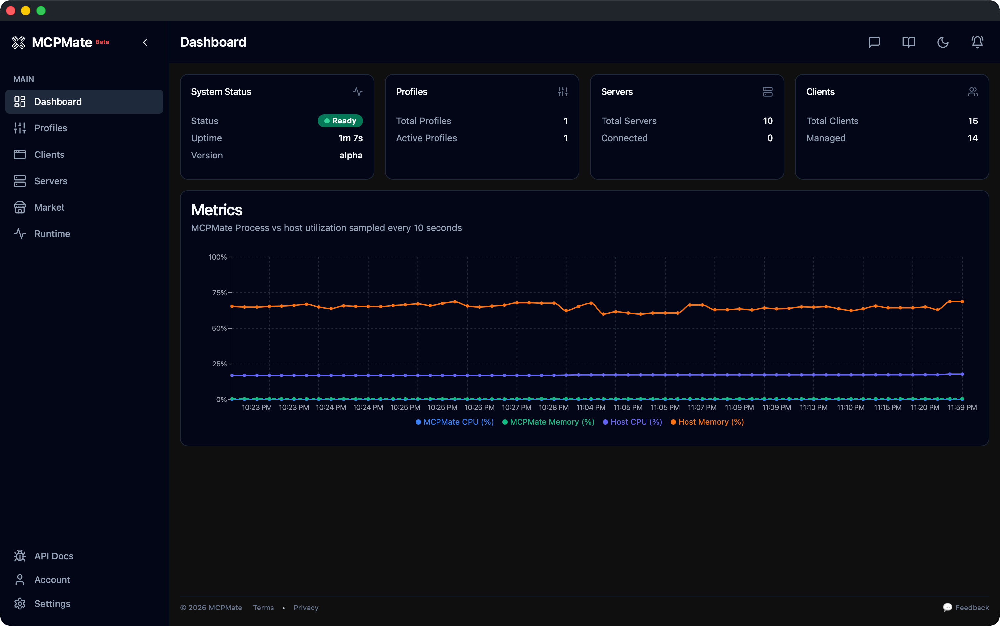
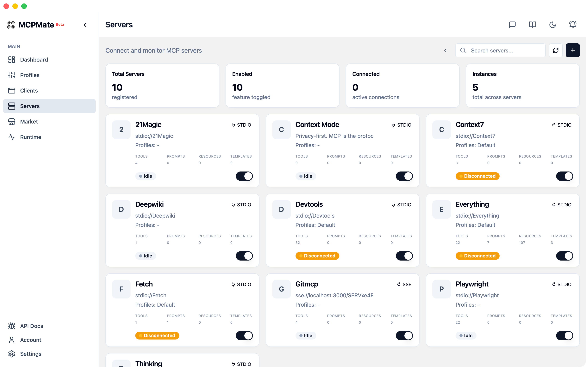
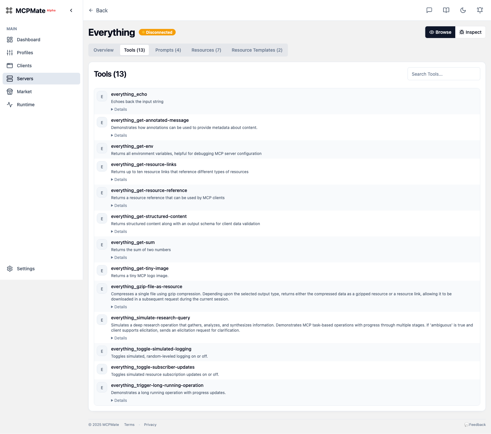
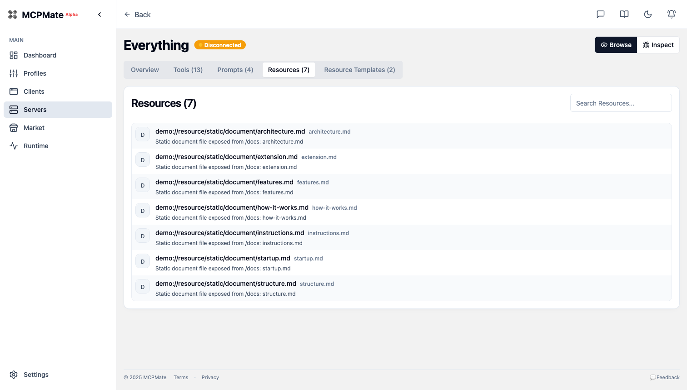
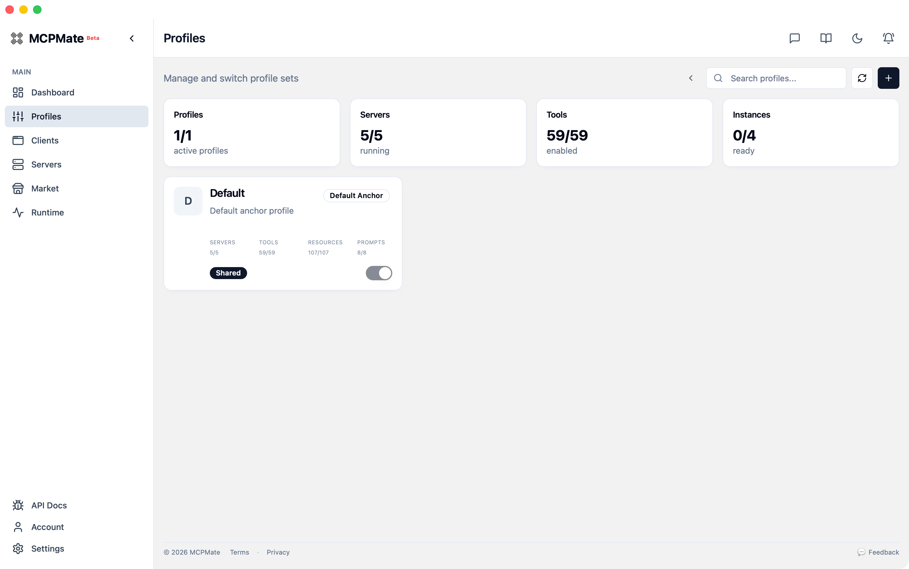
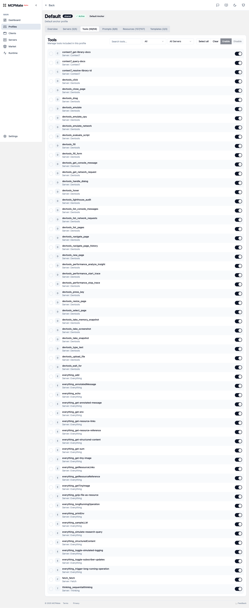
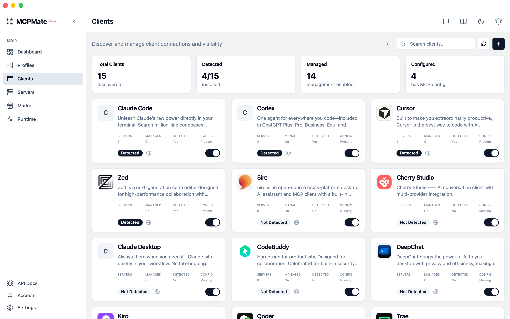
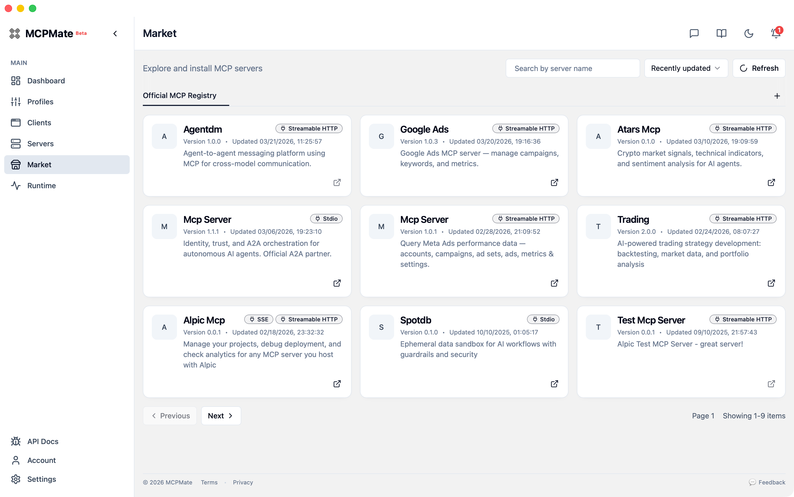
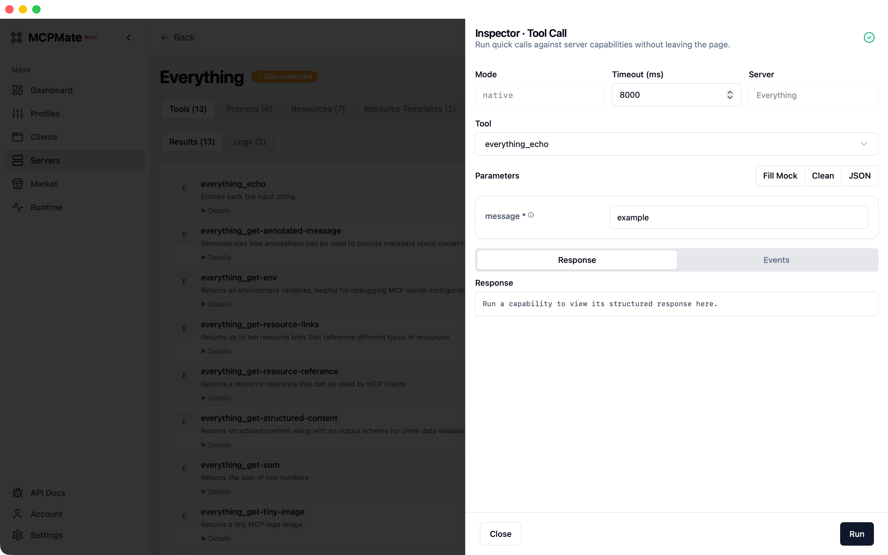

# MCPMate

**中文** | [English](./README.md)

<p align="center">
  
</p>

> **一个管理所有 MCP 服务器和 AI 客户端的中心。**

MCPMate 是一个综合性的 Model Context Protocol (MCP) 管理中心，旨在简化配置、降低资源消耗、增强安全性，为 MCP 生态系统提供统一的管理平台。

## 目录

- [为什么需要 MCPMate？](#为什么需要-mcpmate)
- [核心组件](#核心组件)
- [截图](#截图)
- [快速开始](#快速开始)
- [部署模式](#部署模式)
- [架构](#架构)
- [主要功能](#主要功能)
- [开发](#开发)
- [路线图](#路线图)
- [贡献](#贡献)
- [许可证](#许可证)

## 为什么需要 MCPMate？

在多个 AI 工具（Claude Desktop、Cursor、Zed、Cherry Studio 等）中管理 MCP 服务器面临诸多挑战：

- **配置复杂且重复** — 同一个 MCP 服务器需要在每个客户端中重复配置
- **高昂的上下文切换成本** — 不同工作场景需要频繁切换 MCP 配置
- **资源消耗** — 同时运行多个 MCP 服务器会消耗大量系统资源
- **安全盲区** — 配置错误或安全风险难以被及时发现
- **管理分散** — 没有统一的地方管理所有 MCP 服务

MCPMate 通过集中化的配置管理、智能化的服务调度和增强的安全防护来解决这些问题。

## 核心组件

### Proxy

高性能 MCP 代理服务器：

- 连接多个 MCP 服务器并聚合它们的工具
- 为 AI 客户端提供统一接口
- 实现 stdio 和 Streamable HTTP 传输协议（符合 MCP 2025-06-18 规范）
- 接受旧版 SSE 配置的服务器，并自动归一化为 Streamable HTTP 以保持向后兼容
- 实时监控和审计 MCP 通信
- 检测潜在安全风险（如工具投毒）
- 智能管理服务器资源
- 提供 RESTful API 用于管理和监控

### Bridge

轻量级桥接组件，将 stdio 模式的 MCP 客户端（如 Claude Desktop）连接到 HTTP 模式的 MCPMate 代理：

- 将 stdio 协议转换为 HTTP 传输，无需修改客户端
- 自动继承 HTTP 服务的所有功能和工具
- 极简配置 — 只需服务地址

### Runtime Manager

智能运行时环境管理工具：

- **智能下载** — 15 秒超时，自动网络诊断
- **进度追踪** — 实时进度条，显示下载速度
- **多运行时支持** — Node.js、uv (Python)、Bun.js
- **环境集成** — 自动配置环境变量

```bash
# 安装 Node.js（用于 JavaScript MCP 服务器）
runtime install node

# 安装 uv（用于 Python MCP 服务器）
runtime install uv

# 列出已安装的运行时
runtime list
```

### Desktop App

基于 Tauri 2 的跨平台桌面应用：

- 完整的图形界面，管理 MCP 服务器、Profile 和工具
- 实时监控和状态显示
- 智能客户端检测和配置生成
- 系统托盘集成，原生通知
- 支持 macOS、Windows 和 Linux

### 审计中心

统一记录运行与安全相关事件：

- 将 MCP 调用与管理侧变更汇总为结构化时间线
- 支持基于游标的分页，适配高频事件场景
- 提供审计查询 REST API，用于检索和回溯
- 在 Dashboard 中提供独立的审计日志页面

## 截图

### Dashboard 概览

浅色与深色主题布局一致；状态卡片与资源图表会随主题切换配色。

| 浅色                                            | 深色                                                |
| ----------------------------------------------- | --------------------------------------------------- |
|  |  |

### 服务器管理



### 服务器详情 — 工具

浏览 MCP 服务器暴露的所有工具及其描述。



### 服务器详情 — 资源

查看 MCP 服务器提供的资源。



### Profile 概览

每个 Profile 聚合服务器、工具、资源和提示词，用于特定场景。



### Profile — 工具配置

在 Profile 中启用或禁用单个工具。



### 客户端配置

为每个 AI 客户端配置管理模式和能力来源。



### MCP 市场

在应用内浏览官方 MCP 注册中心并安装服务器。



### 工具检视器

针对已连接服务器快速发起工具调用，并在控制台查看结构化返回。



## 快速开始

### 前置要求

- Rust 工具链 (1.75+)
- Node.js 18+ 或 Bun
- SQLite 3

### 安装

```bash
# 克隆仓库
git clone https://github.com/loocor/MCPMate.git
cd MCPMate

# 构建后端
cd backend
cargo build --release

# 运行代理
cargo run --release
```

代理启动后：
- REST API 在 `http://localhost:8080`
- MCP 端点在 `http://localhost:8000`

### 使用 Dashboard

```bash
# 从仓库根目录
cd board
bun install
bun run dev
```

Dashboard 将在 `http://localhost:5173` 可用。

## 部署模式

MCPMate 同时支持一体化和分离式运行：

- **一体化模式（桌面端）**：Tauri 将后端与控制台打包，本地即可开箱运行
- **分离模式（Core Server + UI）**：后端独立运行，Web 控制台或桌面壳可连接到该核心服务
- **客户端模式兼容**：在控制平面远程运行时，托管/透明等客户端工作流保持可用

## 架构

```
MCPMate/
├── backend/           # Rust MCP 网关、管理 API、bridge 二进制
├── board/             # React + Vite 管理 Dashboard
├── website/           # 营销站点和文档
├── desktop/           # Tauri 2 桌面应用
├── extension/cherry/  # Cherry Studio 配置集成
└── docs/              # 产品文档
```

每个子项目维护自己的构建系统和依赖。详见各自的 README：

- [Backend](./backend/README.md) — 架构、API 和开发指南
- [Board](./board/README.md) — Dashboard 功能和 UI 开发
- [Desktop](./desktop/README.md) — 桌面应用构建和配置
- [Extension/Cherry](./extension/cherry/README.md) — Cherry Studio 集成

## 主要功能

### 基于 Profile 的配置

将 MCP 服务器组织成不同场景的 Profile：
- **开发** — 编码、调试、测试相关工具
- **写作** — 内容创作、研究相关工具
- **分析** — 数据分析、可视化相关工具

在 Profile 之间即时切换，无需重启服务。

### 多客户端支持

MCPMate 检测并配置多种 AI 客户端：
- Claude Desktop
- Cursor
- Zed
- Cherry Studio
- VS Code（带 MCP 扩展）

### 安全

- 实时 MCP 通信监控
- 工具投毒检测
- 敏感数据检测
- 安全告警和审计日志

### 审计日志

- 提供独立的 **审计日志** 页面，可筛选并回溯历史操作
- 事件记录包含 actor、target、action type、timestamp 等核心字段
- 支持游标分页，适合大体量日志的渐进式加载

## 开发

```bash
# 运行所有检查
./scripts/check

# 同时启动后端和 Board
./scripts/dev-all
```

开发指南、编码规范和贡献流程请参阅 [AGENTS.md](./AGENTS.md)。

## 路线图

1. **核心代理增强** — 提升稳定性、性能和功能
2. **安全审计** — 开发 MCPMate Inspector 进行高级安全审计
3. **智能切换** — 基于上下文的自动 Profile 切换
4. **团队协作** — 配置共享和角色访问控制
5. **云端同步** — 多设备配置同步

## 贡献

欢迎贡献！请：

1. 阅读 [AGENTS.md](./AGENTS.md) 了解开发规范
2. 开 issue 讨论重大变更
3. 向 `main` 分支提交 pull request

## 许可证

MIT 许可证 — 详见 [LICENSE](./LICENSE)。

---

由 [Loocor](https://github.com/loocor) 用 ❤️ 构建
