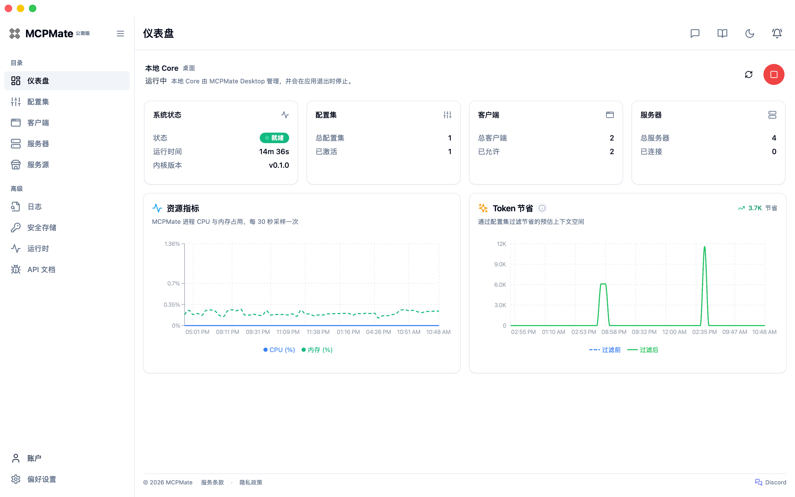
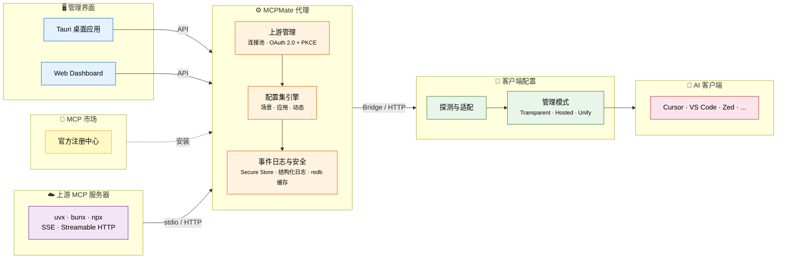

# MCPMate

<p align="right">
  <a href="./README.md">English</a> | <strong>中文</strong> | <a href="./README_JP.md">日本語</a>
</p>

<p align="center">
  
</p>

<p align="center">
  <strong>你的渐进式 MCP 管理伙伴</strong>
</p>

<p align="center">
  <a href="https://github.com/loocor/MCPMate/releases"></a>
  <a href="https://github.com/loocor/MCPMate/releases"></a>
  <a href="https://github.com/loocor/MCPMate/blob/main/LICENSE"></a>
  
  
  <a href="https://modelcontextprotocol.io/specification/2025-11-25"></a>
</p>

---

> **一次导入 MCP。先简单用起来，等工作流变复杂，再逐步加入配置集、按端工具和配置模式。**
>
> 从简单上手到逐步深入，本地 MCP 助手陪你长大，而不只是又一个配置文件整理器。

MCPMate 在 AI 应用与 MCP 服务器之间，让你只维护一份连接，再把合适的工具投放到每个应用。支持 Claude Desktop、Cursor、Codex、Zed、VS Code、命令行，以及符合标准 MCP 配置规范的自定义应用。

**起步轻、跟得上：** 首次导入摩擦低；客户端和场景变多时仍是一套配置，不必换工具、不必重来。

| 阶段 | 你能得到什么 |
| ---- | ------------ |
| **起步** | 导入服务、验证调用、在一处查看运行状态 |
| **深入** | 开发、写作、调研等配置集，一键切换整套工具 |
| **精细** | 同一份服务库，按客户端裁剪可见工具，更省 Token |
| **选接入方式** | **透明**（写入原生配置）、**托管**（代理层长期管控）、**统一**（小工具面、按需发现） |

官网：[mcp.umate.ai](https://mcp.umate.ai) · 文档：[mcp.umate.ai/docs](https://mcp.umate.ai/docs/zh/quickstart)

## 📑 目录

- [MCPMate](#mcpmate)
  - [📑 目录](#-目录)
  - [🤔 为什么需要 MCPMate？](#-为什么需要-mcpmate)
  - [🔄 工作原理](#-工作原理)
  - [🚀 主要功能](#-主要功能)
  - [🛠️ 核心组件](#-核心组件)
    - [Proxy](#proxy)
    - [Bridge](#bridge)
    - [Runtime Manager](#runtime-manager)
    - [桌面应用](#桌面应用)
    - [日志](#日志)
  - [⚡ 快速开始](#-快速开始)
    - [方式一：下载桌面应用（推荐）](#方式一下载桌面应用推荐)
    - [方式二：从源码构建](#方式二从源码构建)
    - [方式三：在线体验](#方式三在线体验)
  - [🧰 技术栈](#-技术栈)
  - [🚢 部署模式](#-部署模式)
  - [🔧 开发](#-开发)
  - [🗺️ 路线图](#-路线图)
  - [🤝 贡献](#-贡献)
  - [📄 许可证](#-许可证)

## 🤔 为什么需要 MCPMate？

在多个 AI 工具（Claude Desktop、Cursor、Zed、Codex、自定义客户端等）里管 MCP，很容易越弄越乱：

| · | 痛点 | · | MCPMate 的做法 |
| --- | ---- | --- | -------------- |
| ❌ | 每个客户端都要手抄一份 MCP 配置 | ✅ | **配一次，处处可用** — 服务器、环境变量、连接只维护一份 |
| ❌ | 开发、写作、调研换场景就要在每个应用里重配 | ✅ | **一键换场景** — 配置集整套切换，不用逐个应用改 |
| ❌ | 每个客户端看到全部工具，界面乱、Token 浪费 | ✅ | **每个客户端，各看各的** — 同库不同可见范围 |
| ❌ | 不同客户端需要的接入方式不一样 | ✅ | **托管**、**统一**、**透明** 三种配置模式按需选择 |
| ❌ | 服务是否就绪、调用是否成功，难以确认 | ✅ | **看得见，查得到** — 检视器、结构化日志与控制台在一处 |
| ❌ | 多个 MCP 进程同时跑，占资源 | ✅ | 单代理聚合上游，连接池复用 |

## 🔄 工作原理



MCPMate 位于 AI 客户端与 MCP 服务器之间。对应用侧而言，它就是一个标准的 MCP 服务，不破坏现有工作流；配置集、策略与路由在中间层完成。**Bridge** 将仅支持 stdio 的客户端（如 Claude Desktop）适配到 HTTP 代理。**配置集引擎** 决定各客户端可见的工具 — 场景配置集对应工作流，应用配置集做按端调优，动态配置集可在运行时调整。**透明**、**托管**、**统一** 三种配置模式，可按需要选择 MCPMate 介入的程度，或只输出原生客户端配置。

## 🚀 主要功能

| 功能                      | 说明                                                                                      |
| ------------------------- | ----------------------------------------------------------------------------------------- |
| **配置集裁剪**            | 将 MCP 服务器组织为场景、应用和动态配置集，即时切换无需重启。                             |
| **多客户端支持**          | 检测、配置和管理 Claude Desktop、Cursor、Zed、Codex 及自定义客户端。                      |
| **动态客户端治理**        | 数据库优先的 Allow/Deny 治理策略，无静态模板文件，写入需已验证的配置目标。                |
| **MCP 市场集成**          | 应用内浏览并安装官方 MCP 注册中心的服务器，详情页可展示 GitHub README、来源元数据与 OAuth 授权信息。 |
| **运行时管理器**          | 安装和管理本地 MCP 服务器使用的 Node.js、uv (Python)、Bun 运行时。                        |
| **Secure Store 与 OAuth 托管** | 将本地 secret、OAuth token 和客户端密钥放入加密托管，并提供生命周期清理与降级状态提示。 |
| **上游 OAuth 2.0 (PKCE)** | 支持 Streamable HTTP MCP 服务器的 OAuth 2.0 流程（含 PKCE），含元数据发现、回调处理与重连路径。 |
| **内建 redb 缓存**        | 面向能力快照与高频代理状态的 L2 嵌入式缓存。                                              |
| **结构化日志**            | 独立日志页面，支持游标分页、actor/target/action 元数据和 REST API 查询。                  |
| **浏览器扩展**            | Chrome/Edge 扩展可浏览 Servers、Clients、Portals，并通过 `mcpmate://import/server` 导入 MCP 片段、GitHub MCP 条目和 Cursor.directory 条目。 |
| **工具检视器**            | 对已连接服务器快速发起工具调用，查看结构化返回结果。                                      |

## 🛠️ 核心组件

### Proxy

高性能 MCP 代理服务器，连接多个 MCP 服务器并聚合工具。实现 stdio 和 Streamable HTTP 传输协议，并对齐当前 MCP 规范；接受旧版 SSE 配置并自动归一化为 Streamable HTTP 以保持向后兼容。

### Bridge

轻量级桥接组件，将 stdio 协议转换为 HTTP 传输，无需修改客户端。自动继承 HTTP 服务的所有功能和工具，极简配置 — 只需服务地址。

### Runtime Manager

安装和管理本地 MCP 服务器使用的运行时。支持 Node.js、uv (Python) 和 Bun，并提供下载进度追踪与自动环境变量配置。

```bash
runtime install node   # 安装 Node.js（用于 JavaScript MCP 服务器）
runtime install uv     # 安装 uv（用于 Python MCP 服务器）
runtime install bun    # 安装 Bun
runtime list           # 列出已安装的运行时
```

### 桌面应用

基于 Tauri 2 的跨平台桌面应用，提供完整的图形界面管理 MCP 服务器、配置集和工具，支持实时监控、智能客户端检测和系统托盘集成。macOS、Windows 与 Linux 桌面构建目前均以 Beta 版本提供。

### 日志

面向 MCP 代理活动的结构化运维日志。将 MCP 操作与管理侧变更汇总为结构化时间线，支持游标分页、REST API 和 Dashboard 中的独立日志页面。

## ⚡ 快速开始

### 方式一：下载桌面应用（推荐）

从 [GitHub Releases](https://github.com/loocor/MCPMate/releases) 下载适合你平台的最新版本。

> **注意**：macOS 构建已加入签名与公证，以减少系统安全提示并提升安装包可信度。

macOS 和 Linux 用户也可以通过 `brew install --cask loocor/tap/mcpmate@beta` 安装 Homebrew Beta 版本；更新和卸载方式请查看[安装指南](https://mcp.umate.ai/docs/zh/installation#homebrew)。

### 方式二：从源码构建

**前置要求**：[Rust](https://www.rust-lang.org/tools/install) 工具链 1.85+、[Node.js](https://nodejs.org/) 18+ 或 [Bun](https://bun.sh/)、SQLite 3

**1. 克隆并构建后端**

```bash
git clone https://github.com/loocor/MCPMate.git
cd MCPMate/backend
cargo build --release
```

**2. 启动代理**

```bash
cargo run --release
```

代理启动后：
- **REST API** 在 `http://localhost:8080`
- **MCP 端点** 在 `http://localhost:8000`

**3. 启动 Dashboard**

```bash
cd ../board
bun install
bun run dev
```

Dashboard 将在 `http://localhost:5173` 可用。

### 方式三：在线体验

Coming soon。线上环境将允许你在无需本地部署的情况下，探索 Dashboard、配置集和客户端配置流程。

## 🧰 技术栈

| 层级             | 技术                                                     |
| ---------------- | -------------------------------------------------------- |
| **代理 / 后端**  | Rust, tokio, rmcp, SQLite（持久化）, redb（L2 能力缓存） |
| **Dashboard**    | React, Vite, Zustand, React Query, Radix UI              |
| **桌面应用**     | Tauri 2, 系统托盘, 原生通知                              |
| **Bridge**       | Rust 二进制, stdio → HTTP 转换                           |
| **运行时管理器** | 多运行时 (Node.js, uv, Bun)                              |
| **协议**         | MCP 2025-11-25, stdio + Streamable HTTP                  |

## 🚢 部署模式

- **一体化模式（桌面端）** — Tauri 将后端与控制台打包，本地即可开箱运行
- **分离模式（Core Server + UI）** — 后端独立运行，Web 控制台或桌面壳可连接到该核心服务
- **客户端模式兼容** — 在控制平面远程运行时，托管/透明等客户端工作流保持可用

## 🔧 开发

```bash
# 运行所有检查
./scripts/check

# 同时启动后端和 Board
./scripts/dev-all
```

开发指南、编码规范和贡献流程请参阅 [AGENTS.md](./AGENTS.md)。

## 🗺️ 路线图

1. **发现到安装链路打磨** — 继续收紧浏览器扩展、服务源、README 与来源元数据流程
2. **基于账户体系的配置数据备份与恢复**
3. **以 Skills 模式封装的配置集**
4. **Standalone Inspector** — 提供聚焦的 MCP Server 连接、能力发现与调用验证入口

## 🤝 贡献

欢迎贡献！请：

1. 阅读 [AGENTS.md](./AGENTS.md) 了解开发规范
2. 开 issue 讨论重大变更
3. 向 `main` 分支提交 pull request

## 📄 许可证

[GNU Affero General Public License v3.0](./LICENSE) (AGPL-3.0)
