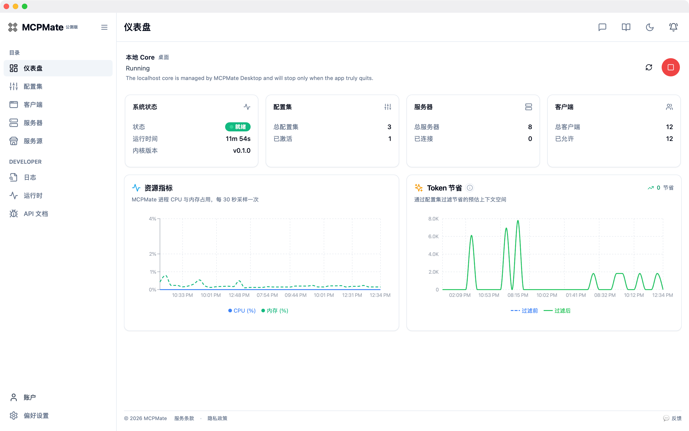
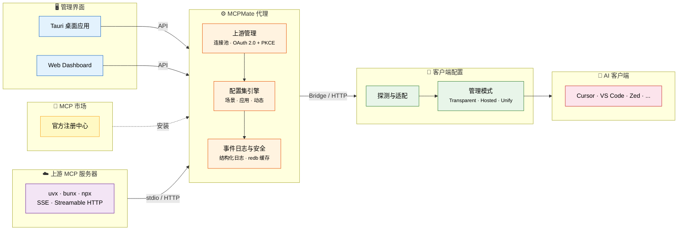

# MCPMate

**中文** | [English](./README.md)

<p align="center">
  
</p>

<p align="center">
  <strong>一个本地代理，连接 MCP 服务器与 AI 客户端。</strong>
</p>

<p align="center">
  <a href="https://github.com/loocor/MCPMate/blob/main/LICENSE"></a>
  
  
  
  <a href="https://modelcontextprotocol.io/specification/2025-06-18"></a>
</p>

---

> 在多个客户端重复配置同一批 MCP 服务器既繁琐，也会抬高首次对话的 Token 成本，并且难以观测运行状态。
> MCPMate 通过本地代理汇聚 MCP 服务器、同步客户端配置、按配置集裁剪能力，并记录运行日志。

这不是一个全新的项目。我从 2024 年 5 月左右开始打磨 MCPMate，在 10 月左右暂停了活跃开发，最近又重新回到这个方向，并且有了更清晰的判断：当 Skills 与 CLI 形态的热度逐渐回落、进入更审慎的反思阶段时，MCP 的长期价值与不可替代性反而变得更容易看清。

MCPMate 此前主要在私下开发，现在重新以开源方式公开。现阶段我最关心的方向是可用性：在 MCPMate 早先基于配置集、按具体场景剔除冗余能力的思路之上，继续把托管模式延伸为一种渐进式披露的智能模式（去年我把它叫"激进托管模式"，不过听起来有点儿怪），目标之一就是把大家在 Skills 与 CLI 体验中感受到的那种更低摩擦、更低首次 Token 消耗的特性，也尽可能迁移到 MCP 本身。

## 📑 目录

- [MCPMate](#mcpmate)
  - [📑 目录](#-目录)
  - [🤔 为什么需要 MCPMate？](#-为什么需要-mcpmate)
  - [🔄 工作原理](#-工作原理)
  - [🚀 主要功能](#-主要功能)
  - [🛠️ 核心组件](#-核心组件)
    - [Proxy](#proxy)
    - [Bridge](#bridge)
    - [Runtime Manager](#runtime-manager)
    - [桌面应用](#桌面应用)
    - [日志](#日志)
  - [⚡ 快速开始](#-快速开始)
    - [方式一：下载桌面应用（推荐）](#方式一下载桌面应用推荐)
    - [方式二：从源码构建](#方式二从源码构建)
    - [方式三：在线体验](#方式三在线体验)
  - [🧰 技术栈](#-技术栈)
  - [🚢 部署模式](#-部署模式)
  - [🔧 开发](#-开发)
  - [🗺️ 路线图](#-路线图)
  - [🤝 贡献](#-贡献)
  - [📄 许可证](#-许可证)

## 🤔 为什么需要 MCPMate？

在多个 AI 工具（Claude Desktop、Cursor、Zed、Codex、自定义客户端等）中管理 MCP 服务器面临诸多挑战：

| · | 痛点                                        | · | MCPMate 方案                      |
| --- | ------------------------------------------- | --- | --------------------------------- |
| ❌   | 同一个 MCP 服务器需要在每个客户端中重复配置 | ✅   | 一个代理，一份统一配置            |
| ❌   | 不同工作场景需要频繁切换 MCP 配置           | ✅   | 基于配置集的即时切换              |
| ❌   | 同时运行多个 MCP 服务器消耗大量系统资源     | ✅   | 单个代理聚合所有上游服务器        |
| ❌   | 配置错误或安全风险难以被及时发现            | ✅   | 实时监控、结构化事件日志          |
| ❌   | 没有统一的地方管理所有 MCP 服务             | ✅   | Dashboard + REST API + 结构化日志 |

## 🔄 工作原理



MCPMate 作为透明代理位于 AI 客户端和 MCP 服务器之间。**Bridge** 将仅支持 stdio 的客户端（如 Claude Desktop）适配到 HTTP 代理。**配置集引擎**控制哪些工具对哪些客户端可见 — 场景配置集用于工作流上下文，应用配置集用于客户端级调优，动态配置集可在运行时自动调整。客户端配置层覆盖 **Transparent**、**Hosted** 与 **Unify** 三种管理模式。

## 🚀 主要功能

| 功能                      | 说明                                                                                      |
| ------------------------- | ----------------------------------------------------------------------------------------- |
| **配置集裁剪**            | 将 MCP 服务器组织为场景、应用和动态配置集，即时切换无需重启。                             |
| **多客户端支持**          | 检测、配置和管理 Claude Desktop、Cursor、Zed、Codex 及自定义客户端。                      |
| **动态客户端治理**        | 数据库优先的 Allow/Deny 治理策略，无静态模板文件，写入需已验证的配置目标。                |
| **MCP 市场集成**          | 应用内浏览并安装官方 MCP 注册中心的服务器，支持 OAuth 回调授权。                          |
| **运行时管理器**          | 安装和管理本地 MCP 服务器使用的 Node.js、uv (Python)、Bun 运行时。                        |
| **上游 OAuth 2.0 (PKCE)** | 支持 Streamable HTTP MCP 服务器的 OAuth 2.0 流程（含 PKCE），含元数据发现和回调处理。     |
| **内建 redb 缓存**        | 面向能力快照与高频代理状态的 L2 嵌入式缓存。                                              |
| **结构化日志**            | 独立日志页面，支持游标分页、actor/target/action 元数据和 REST API 查询。                  |
| **浏览器扩展**            | Chrome/Edge 扩展检测网页中的 `mcpServers` 配置片段并通过 `mcpmate://import/server` 导入。 |
| **工具检视器**            | 对已连接服务器快速发起工具调用，查看结构化返回结果。                                      |

## 🛠️ 核心组件

### Proxy

高性能 MCP 代理服务器，连接多个 MCP 服务器并聚合工具。实现 stdio 和 Streamable HTTP 传输协议（符合 MCP 2025-06-18 规范），接受旧版 SSE 配置并自动归一化为 Streamable HTTP 以保持向后兼容。

### Bridge

轻量级桥接组件，将 stdio 协议转换为 HTTP 传输，无需修改客户端。自动继承 HTTP 服务的所有功能和工具，极简配置 — 只需服务地址。

### Runtime Manager

安装和管理本地 MCP 服务器使用的运行时。支持 Node.js、uv (Python) 和 Bun，并提供下载进度追踪与自动环境变量配置。

```bash
runtime install node   # 安装 Node.js（用于 JavaScript MCP 服务器）
runtime install uv     # 安装 uv（用于 Python MCP 服务器）
runtime install bun    # 安装 Bun
runtime list           # 列出已安装的运行时
```

### 桌面应用

基于 Tauri 2 的跨平台桌面应用，提供完整的图形界面管理 MCP 服务器、配置集和工具，支持实时监控、智能客户端检测和系统托盘集成。macOS 现已可用；Windows 处于 Beta 阶段；Linux 正在开发中。

### 日志

面向 MCP 代理活动的结构化运维日志。将 MCP 操作与管理侧变更汇总为结构化时间线，支持游标分页、REST API 和 Dashboard 中的独立日志页面。

## ⚡ 快速开始

### 方式一：下载桌面应用（推荐）

从 [GitHub Releases](https://github.com/loocor/MCPMate/releases) 下载适合你平台的最新版本。

> **注意**：macOS 构建目前未经签名和公证。首次启动时可能需要右键点击选择"打开"以绕过 Gatekeeper。代码签名和公证将在后续版本中加入。

### 方式二：从源码构建

**前置要求**：[Rust](https://www.rust-lang.org/tools/install) 工具链 1.75+、[Node.js](https://nodejs.org/) 18+ 或 [Bun](https://bun.sh/)、SQLite 3

**1. 克隆并构建后端**

```bash
git clone https://github.com/loocor/MCPMate.git
cd MCPMate/backend
cargo build --release
```

**2. 启动代理**

```bash
cargo run --release
```

代理启动后：
- **REST API** 在 `http://localhost:8080`
- **MCP 端点** 在 `http://localhost:8000`

**3. 启动 Dashboard**

```bash
cd ../board
bun install
bun run dev
```

Dashboard 将在 `http://localhost:5173` 可用。

### 方式三：在线体验

Coming soon。线上环境将允许你在无需本地部署的情况下，探索 Dashboard、配置集和客户端配置流程。

## 🧰 技术栈

| 层级             | 技术                                                     |
| ---------------- | -------------------------------------------------------- |
| **代理 / 后端**  | Rust, tokio, rmcp, SQLite（持久化）, redb（L2 能力缓存） |
| **Dashboard**    | React, Vite, Zustand, React Query, Radix UI              |
| **桌面应用**     | Tauri 2, 系统托盘, 原生通知                              |
| **Bridge**       | Rust 二进制, stdio → HTTP 转换                           |
| **运行时管理器** | 多运行时 (Node.js, uv, Bun)                              |
| **协议**         | MCP 2025-06-18, stdio + Streamable HTTP                  |

## 🚢 部署模式

- **一体化模式（桌面端）** — Tauri 将后端与控制台打包，本地即可开箱运行
- **分离模式（Core Server + UI）** — 后端独立运行，Web 控制台或桌面壳可连接到该核心服务
- **客户端模式兼容** — 在控制平面远程运行时，托管/透明等客户端工作流保持可用

## 🔧 开发

```bash
# 运行所有检查
./scripts/check

# 同时启动后端和 Board
./scripts/dev-all
```

开发指南、编码规范和贡献流程请参阅 [AGENTS.md](./AGENTS.md)。

## 🗺️ 路线图

1. **基于账户体系的配置数据备份与恢复**
2. **以 Skills 模式封装的配置集**
3. **下游 MCP 客户端 OAuth 授权管理**
4. **跨平台发布就绪** — 覆盖主要桌面操作系统稳定性、容器化部署与 Homebrew 安装支持

## 🤝 贡献

欢迎贡献！请：

1. 阅读 [AGENTS.md](./AGENTS.md) 了解开发规范
2. 开 issue 讨论重大变更
3. 向 `main` 分支提交 pull request

## 📄 许可证

[GNU Affero General Public License v3.0](./LICENSE) (AGPL-3.0)

---

<p align="center">
  由 <a href="https://github.com/loocor">Loocor</a> 用 ❤️ 构建
</p>
