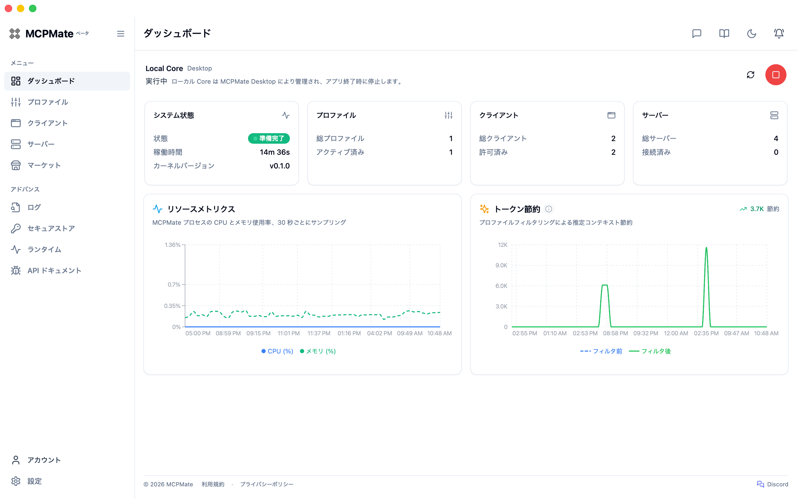
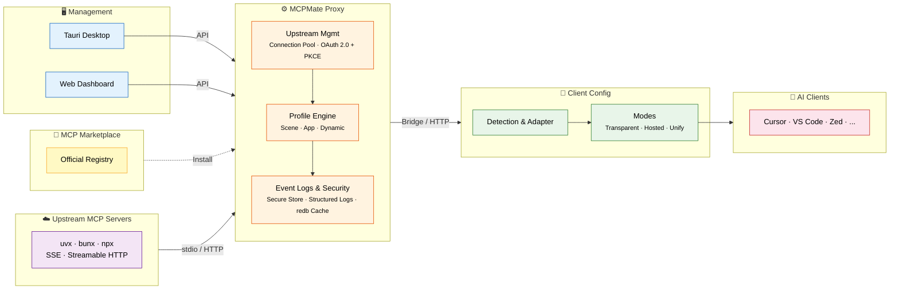

# MCPMate

<p align="right">
  <a href="./README.md">English</a> | <a href="./README_CN.md">中文</a> | <strong>日本語</strong>
</p>

<p align="center">
  
</p>

<p align="center">
  <strong>あなたの段階的な MCP 管理パートナー。</strong>
</p>

<p align="center">
  <a href="https://github.com/loocor/MCPMate/releases"></a>
  <a href="https://github.com/loocor/MCPMate/releases"></a>
  <a href="https://github.com/loocor/MCPMate/blob/main/LICENSE"></a>
  
  
  <a href="https://modelcontextprotocol.io/specification/2025-11-25"></a>
</p>

---

> **MCP を一度インポート。まずはシンプルに始め、ワークフローの成長に合わせてプロファイル、クライアント別ツール、セットアップモードを追加できます。**
>
> MCPMate はローカルファーストのアシスタントです。単なる設定ファイル編集ツールではなく、利用状況に合わせて段階的に広げられます。

MCPMate は AI アプリと MCP サーバーの間に入り、接続を一か所で管理し、必要なツールだけを各アプリへ届けます。Claude Desktop、Cursor、Codex、Zed、VS Code、CLI ツール、標準 MCP 設定形式に従うその他のクライアントで利用できます。

**始めやすく、拡張しやすい:** 最初のインポートは低摩擦。クライアント、サーバー、利用シーンが増えても同じセットアップで続けられます。ツールを乗り換えたり、最初からやり直したりする必要はありません。

| 段階 | 得られること |
| ---- | ------------ |
| **Start** | サーバーをインポートし、呼び出しを検証し、状態を一か所で確認 |
| **Grow** | コーディング、執筆、調査などのシーンプロファイルをワンクリックで切り替え |
| **Tune** | 共有サーバーライブラリからクライアントごとに見えるツールを調整し、混雑とトークン使用を削減 |
| **Choose how to connect** | **Transparent**、**Hosted**、**Unify** の各モードで必要な制御レベルを選択 |

公式サイト: [mcp.umate.ai](https://mcp.umate.ai) · ドキュメント: [mcp.umate.ai/docs](https://mcp.umate.ai/docs/ja/quickstart)

## 📑 目次

- [MCPMate](#mcpmate)
  - [📑 目次](#-目次)
  - [🤔 なぜ MCPMate？](#-なぜ-mcpmate)
  - [🔄 仕組み](#-仕組み)
  - [🚀 主な機能](#-主な機能)
  - [🛠️ コアコンポーネント](#-コアコンポーネント)
    - [Proxy](#proxy)
    - [Bridge](#bridge)
    - [Runtime Manager](#runtime-manager)
    - [Desktop App](#desktop-app)
    - [Logs](#logs)
  - [⚡ クイックスタート](#-クイックスタート)
    - [Option A: デスクトップアプリをダウンロード（推奨）](#option-a-デスクトップアプリをダウンロード推奨)
    - [Option B: ソースからビルド](#option-b-ソースからビルド)
    - [Option C: オンラインデモ](#option-c-オンラインデモ)
  - [🧰 技術スタック](#-技術スタック)
  - [🚢 デプロイモード](#-デプロイモード)
  - [🔧 開発](#-開発)
  - [🗺️ ロードマップ](#-ロードマップ)
  - [🤝 コントリビュート](#-コントリビュート)
  - [📄 ライセンス](#-ライセンス)

## 🤔 なぜ MCPMate？

複数の AI ツール（Claude Desktop、Cursor、Zed、Codex、カスタムクライアントなど）で MCP を管理すると、すぐに複雑になります。

| · | 課題 | · | MCPMate のアプローチ |
| --- | ---- | --- | -------------------- |
| ❌ | 同じ MCP 設定を各クライアントへ手作業でコピーする | ✅ | **一度設定して、どこでも使う** — サーバー、環境変数、接続を一か所で管理 |
| ❌ | コーディング、執筆、調査などの切り替えごとに各アプリを再設定する | ✅ | **シーンをすぐ切り替え** — プロファイルでツールセット全体を一括変更 |
| ❌ | すべてのクライアントにすべてのツールが見えて、UI とコンテキストが散らかる | ✅ | **クライアントごとに必要なものだけ表示** — ひとつのライブラリから可視範囲を調整 |
| ❌ | クライアントごとに最適な接続方式が違う | ✅ | **Hosted**、**Unify**、**Transparent** のセットアップモードを選択 |
| ❌ | サービスが準備できているか、呼び出しが成功しているか分かりにくい | ✅ | **見て、検証できる** — Inspector、構造化ログ、ダッシュボードをローカルに集約 |
| ❌ | 多数の MCP プロセスが RAM やハンドルを消費する | ✅ | 単一プロキシが上流サーバーを集約し、接続プールを再利用 |

## 🔄 仕組み



MCPMate は AI クライアントと MCP サーバーの間に位置します。各アプリからは通常の MCP エンドポイントに見えるため、既存の作業を壊さず、プロファイル、ポリシー、ルーティングを中間層で管理できます。**Bridge** は Claude Desktop のような stdio 専用クライアントを HTTP プロキシへ接続します。**Profile Engine** は、どのツールをどのクライアントに見せるかを決めます。シーンプロファイルはワークフロー向け、アプリプロファイルはクライアント別調整向け、動的プロファイルは実行時の変更向けです。**Transparent**、**Hosted**、**Unify** の各モードにより、MCPMate をどこまで経路に入れるか、またはネイティブ設定を書き出すかを選べます。

## 🚀 主な機能

| 機能 | 説明 |
| ---- | ---- |
| **Profile-Based Trimming** | MCP サーバーをシーン、アプリ、動的プロファイルとして整理し、サービス再起動なしで切り替えできます。 |
| **Multi-Client Support** | Claude Desktop、Cursor、Zed、Codex、ユーザー定義クライアントを検出、設定、管理できます。 |
| **Dynamic Client Governance** | Allow/Deny ポリシーをデータベース中心で管理します。静的テンプレートに依存せず、書き込みには検証済み設定先が必要です。 |
| **Market Integration** | 公式 MCP Registry をアプリ内で閲覧、インストールできます。詳細画面では GitHub README、ソースメタデータ、OAuth 認可情報を確認できます。 |
| **Runtime Manager** | ローカル MCP サーバーが使う Node.js、uv (Python)、Bun ランタイムをインストール、管理します。 |
| **Secure Store & OAuth Custody** | ローカル secret、OAuth token、client secret を暗号化された保管領域に置き、ライフサイクル整理と degraded-state guidance を提供します。 |
| **OAuth 2.0 Upstream (PKCE)** | Streamable HTTP MCP サーバー向けの OAuth 2.0 + PKCE フローを、メタデータ検出、コールバック処理、再接続フロー込みでサポートします。 |
| **Built-in redb Cache** | capability snapshot と高頻度に使われる proxy state 向けの L2 embedded cache です。 |
| **Structured Logs** | actor/target/action メタデータ、cursor pagination、REST API を備えた専用 Logs ページを提供します。 |
| **Browser Extension** | Chrome/Edge 拡張で Servers、Clients、Portals を閲覧し、MCP snippets、GitHub MCP entries、Cursor.directory entries を `mcpmate://import/server` 経由で取り込めます。 |
| **Tool Inspector** | 接続済みサーバーに対してツール呼び出しを試し、構造化レスポンスをコンソールから確認できます。 |

## 🛠️ コアコンポーネント

### Proxy

複数の MCP サーバーに接続し、ツールを集約する高性能 MCP プロキシサーバーです。現在の MCP 仕様に合わせて stdio と Streamable HTTP transport protocol を実装し、旧 SSE 設定のサーバーも Streamable HTTP として正規化して後方互換性を保ちます。

### Bridge

クライアントを変更せずに stdio protocol を HTTP transport へ変換する軽量ブリッジです。HTTP サービスの機能とツールを自動的に継承し、サービスアドレスだけで設定できます。

### Runtime Manager

ローカル MCP サーバーが使うランタイムをインストール、管理します。Node.js、uv (Python)、Bun をサポートし、ダウンロード進捗と自動環境変数設定を扱います。

```bash
runtime install node   # JavaScript MCP servers 用に Node.js をインストール
runtime install uv     # Python MCP servers 用に uv をインストール
runtime install bun    # Bun をインストール
runtime list           # インストール済みランタイムを表示
```

### Desktop App

Tauri 2 で構築されたクロスプラットフォームのデスクトップアプリです。MCP サーバー、プロファイル、ツールを管理する GUI を備え、リアルタイム監視、クライアント検出、システムトレイ連携を提供します。macOS、Windows、Linux のデスクトップビルドは現在 Beta release として提供されています。

### Logs

MCP proxy activity のための構造化運用ログです。MCP 操作と管理側の変更を構造化タイムラインへまとめ、cursor pagination、REST API、dashboard UI の専用 Logs ページから確認できます。

## ⚡ クイックスタート

### Option A: デスクトップアプリをダウンロード（推奨）

[GitHub Releases](https://github.com/loocor/MCPMate/releases) から利用環境に合う最新リリースをダウンロードしてください。

> **Note**: macOS builds は署名と notarization 済みで、システムのセキュリティプロンプトを減らし、パッケージの信頼性を高めます。

macOS と Linux では `brew install --cask loocor/tap/mcpmate@beta` で Homebrew Beta 版もインストールできます。更新とアンインストールについては[インストールガイド](https://mcp.umate.ai/docs/ja/installation#homebrew)を参照してください。

### Option B: ソースからビルド

**Prerequisites**: [Rust](https://www.rust-lang.org/tools/install) 1.85+、[Node.js](https://nodejs.org/) 18+ または [Bun](https://bun.sh/)、SQLite 3

**1. Clone & Build the Backend**

```bash
git clone https://github.com/loocor/MCPMate.git
cd MCPMate/backend
cargo build --release
```

**2. Start the Proxy**

```bash
cargo run --release
```

プロキシは次のエンドポイントで起動します:
- **REST API**: `http://localhost:8080`
- **MCP endpoint**: `http://localhost:8000`

**3. Launch the Dashboard**

```bash
cd ../board
bun install
bun run dev
```

Dashboard は `http://localhost:5173` で利用できます。

### Option C: オンラインデモ

Coming soon. ローカルセットアップなしで dashboard、profiles、client configuration を試せるオンライン環境を準備中です。

## 🧰 技術スタック

| レイヤー | 技術 |
| -------- | ---- |
| **Proxy / Backend** | Rust, tokio, rmcp, SQLite (persistence), redb (L2 capability cache) |
| **Dashboard** | React, Vite, Zustand, React Query, Radix UI |
| **Desktop** | Tauri 2, system tray, native notifications |
| **Bridge** | Rust binary, stdio-to-HTTP conversion |
| **Runtime Manager** | Multi-runtime (Node.js, uv, Bun) |
| **Protocol** | MCP 2025-11-25, stdio + Streamable HTTP |

## 🚢 デプロイモード

- **Integrated mode (desktop)** — Tauri が backend と dashboard を同梱し、ローカルで一体運用できます
- **Separated mode (core server + UI)** — backend を独立して起動し、web dashboard または desktop shell から接続できます
- **Client mode flexibility** — control plane をリモートで動かしても、managed clients は hosted/transparent workflows を続けられます

## 🔧 開発

```bash
# すべてのチェックを実行
./scripts/check

# backend と board をまとめて起動
./scripts/dev-all
```

開発ガイドライン、コーディング規約、コントリビューションフローは [AGENTS.md](./AGENTS.md) を参照してください。

## 🗺️ ロードマップ

1. **Discovery-to-install polish** — browser extension、Market、README、source metadata flow をさらに磨き込みます
2. **Account-based configuration backup & restore**
3. **Skills-mode packaged profiles**
4. **Standalone Inspector** — MCP Server の接続、能力発見、呼び出し検証に集中できる独立した入口

## 🤝 コントリビュート

コントリビューションを歓迎します。

1. [AGENTS.md](./AGENTS.md) で開発ガイドラインを確認してください
2. 大きな変更は issue で相談してください
3. `main` ブランチに pull request を送ってください

## 📄 ライセンス

[GNU Affero General Public License v3.0](./LICENSE) (AGPL-3.0)
